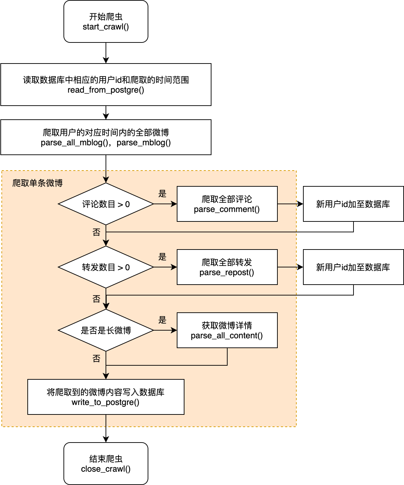

在postgreSQL中定义了两个表：mblog表和userid表

```SQL
CREATE TABLE mblog(
	lang	text,
	src		text,
	cat 	text,
	subcat 	text,
	meta 	text,
	body 	text
);
```

```SQL
CREATE table userid (
	id CHAR(10) PRIMARY KEY,    --用户id，新浪用户唯一标识
	last_crawl timestamp,   --上次爬取该用户的时间
    next_crawl timestamp    --下次爬取该用户的时间
);
```
其中userid表中next_crawl的设定规则为：该用户第一页中的第一条和最后一条的时间间隔+现在的时间

爬取限制：
1. 单用户只能爬取200条信息
2. 二级评论只能获取1页

爬取字段：保留了所有字段，没有对原爬取字段进行删减，可能有些冗余。

流程图：


